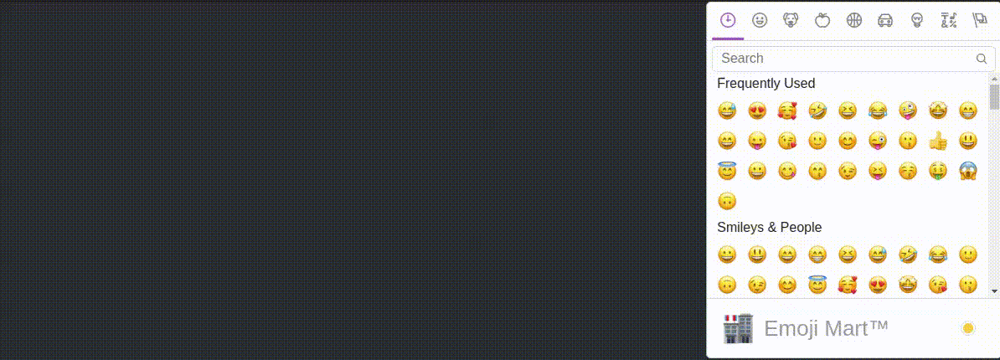

# react-flying-objects

A lightweight React package to make your object/s fly :)




## DEPENDENCIES

`npm install --save react-native-web`

## INSTALLATION

`npm install --save react-flying-objects`

## PURPOSE

The main point of that library is to animate whatever you want, in a whatever direction and speed by using specific easing. You can also use a delay. And all of that stuff should be run in the web browser.
We have many great libraries that give that opportunity, but the reason I wrote that lib was to create animations really fast and in the most intuitive way as for the frontend programmer.

## HOW IT WORKS?

You have to think about like an html container, where css is the ruler.
We can assume we have so many anmimations as we can imagine.

In this library I use most common function of React Native lib which is [Animated.timing()](https://reactnative.dev/docs/animated#timing). As you can see there, you can use all those props including the one I added in my package called `fromValue`. Which means "the point" we start.
All the keys of `objectConfig` should be a valid names of the React Native [styles](https://github.com/vhpoet/react-native-styling-cheat-sheet). So called "React" camelCased styles .

In my demo I show you one of my [example input objectConfig](examples/flying-emoji.js). If you'd have your own great examples, please share them by commiting in the [examples section](examples/).

## WORKING EXAMPLE USING [emoji-mart](https://www.npmjs.com/package/emoji-mart)

```jsx
import { useMemo, useState } from 'react'
import { Easing } from 'react-native-web'
import { Emoji, Picker } from 'emoji-mart'
import Fly from 'react-flying-objects'

import 'emoji-mart/css/emoji-mart.css'

const DELAY = 1000
const DURATION = 5000
const SIZE = 25

const random = (min, max) => Math.floor(Math.random() * (max - min) + min)

const App = () => {
  const [animatedEmoji, setAnimatedEmoji] = useState() // To randomly set values in the objectConfig
  const [flyingObjects, setFlyingObjects] = useState([]) // Used to manage all flying currently objects by the Fly component

  const onSelect = emojiData => {
    const emoji = <Emoji emoji={emojiData} size={SIZE} />
    setAnimatedEmoji(emoji) // Setting the object which would fly in a moment
  }

  const objectConfig = useMemo(() => ({ // Config for a single flying object which would fly in a moment
    right: {
      fromValue: 0,
      toValue: 800,
      duration: DURATION,
      delay: DELAY,
    },
    top: {
      fromValue: random(100, 200),
      toValue: random(100, 200),
      duration: DURATION,
      easing: Easing.elastic(5),
      delay: DELAY,
    },
    width: {
      fromValue: random(SIZE - 10, SIZE + 10),
      toValue: SIZE,
      duration: DURATION,
      easing: Easing.elastic(5),
      delay: DELAY,
    },
    height: {
      fromValue: random(SIZE - 10, SIZE + 10),
      toValue: SIZE,
      duration: DURATION,
      easing: Easing.elastic(5),
      delay: DELAY,
    },
    opacity: {
      fromValue: 1,
      toValue: 0,
      duration: DURATION,
      easing: Easing.exp,
      delay: DELAY,
    }
  }), [animatedEmoji]) // On animatedEmoji change we calculate new random values for the next flying object

  return (
    <div className="App">
      <Fly
        objectToFly={animatedEmoji}
        objectConfig={objectConfig}
        flyingObjects={flyingObjects}
        setFlyingObjects={setFlyingObjects}
      />
      <Picker set='apple' onSelect={onSelect} />
    </div>
  )
}

export default App

```

See it on [CodeSandbox](https://codesandbox.io/s/quizzical-stonebraker-miyxq).

## WHAT'S NEXT?

- resign from the react-native-web peerDependency
